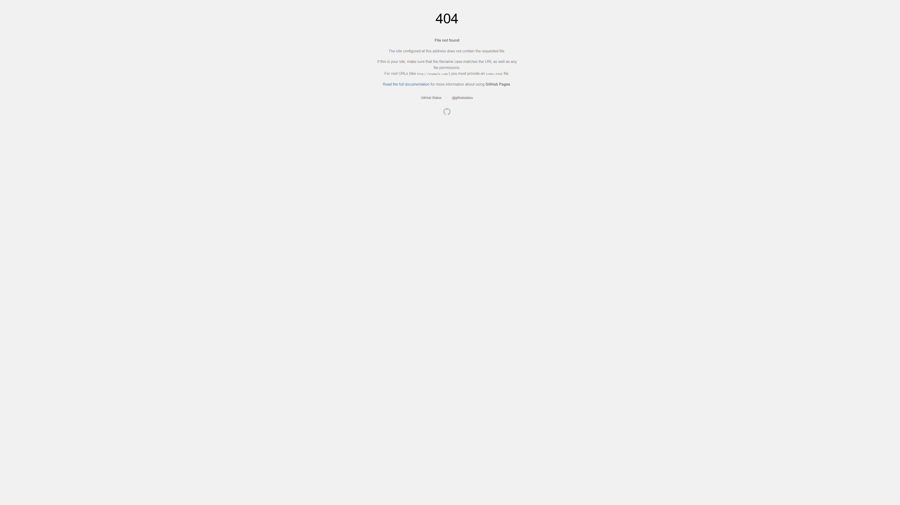

# Life Calendar 

> 💡 Inspired by [thelifecalendar.com](https://thelifecalendar.com). They covered mobile devices, I wanted it on PC as well — so here we go!

## How to Use

[how_to.webm](https://github.com/user-attachments/assets/249e1b3b-a9d8-4d15-b40a-4cb7f45870d2)

### Quick Start

Run the following commands in your PowerShell terminal to download and set up the wallpaper script instantly:

**1. Download the script**
```powershell
mkdir "C:\tools\lifecal" -Force; curl.exe -L "https://raw.githubusercontent.com/shanujha/lifecalendar-desktop/main/scripts/update_wallpaper.ps1" -o "C:\tools\lifecal\lifecal.ps1"
```

**2. Run Default Version**
```powershell
pwsh -File "C:\tools\lifecal\lifecal.ps1"
```

**3. Run Core Version (Minimalist)**
```powershell
pwsh -File "C:\tools\lifecal\lifecal.ps1" -core
```

## Contents
- [Overview](#overview)
- [Usage](#usage)
- [Configuration Parameters](#configuration-parameters)
- [Automation (Desktop Integration)](#automation-desktop-integration)
- [Contributing](#contributing)
- [License](#license)

## Overview

A high-resolution calendar generation engine that renders your year as a minimalist grid. Designed primarily for desktop wallpapers, it supports resolutions up to 8K with automated scaling and system integration.

### 8K Render Examples
| Default Fit (Scale 1.0) | Jumbo Dots (Scale 2.0) | With Labels | Core Cluster |
| :--- | :--- | :--- | :--- |
|  |  |  |  |

## Usage

### For Windows Users

If you prefer manual setup, save the script to `C:\tools\lifecal\lifecal.ps1`.

If you are using **Windows PowerShell (v5.1)**, you may need to bypass the execution policy:
```powershell
powershell.exe -NoProfile -ExecutionPolicy Bypass -File "C:\tools\lifecal\lifecal.ps1"
```

For **PowerShell 7 (pwsh)**, simply use:
```powershell
pwsh -File "C:\tools\lifecal\lifecal.ps1"
```

I recommend adding `C:\tools\lifecal` to your system **Path**. This allows you to run the script or automate it via the **Windows Run (Win+R)** window from anywhere.

---

The application is hosted at [shanujha.github.io/lifecalendar-desktop/](https://shanujha.github.io/lifecalendar-desktop/). 

You can use the site directly to generate a layout, but for the best experience (especially for 4K/8K wallpapers), use the **URL Parameters** or the **Automation Scripts** provided below.

## Configuration Parameters

The engine is controlled via URL query parameters. Append these to the base URL to customize the output.

### Display Options
By default, the interface is a minimalist dot grid.
- `months=true`: Displays month names.
- `weeks=true`: Displays weekday labels (S M T W T F S).

### Resolution and Scaling
The engine uses a **Best-Fit Algorithm** that automatically calculates the optimal dot size for your resolution.
- `res`: Standard presets: `1080p`, `4k`, `8k`.
- `w` / `h`: Custom width and height in pixels.
- `scale`: Manual multiplier for the "Best-Fit" calculation.
  - `1.0` (Default): Perfectly fills the screen edge-to-edge.
  - `0.8`: Adds a comfortable margin around the grid.
  - `1.2`: Enthusiastic bloom; dots become larger and may overflow the screen edges.

## Automation (Desktop Integration)

For a seamless experience, we provide scripts to render and set your wallpaper in one command.

### Windows (PowerShell)
The `scripts/update_wallpaper.ps1` script launches a headless browser, renders the calendar at your desired resolution, saves it to your `assets/` folder, and sets it as both your **Desktop Background** and **Lock Screen**.

**Usage:**
```powershell
# Set a clean 4K wallpaper
.\scripts\update_wallpaper.ps1 -res 4k

# Set a Detailed 8K wallpaper with jumbo dots
.\scripts\update_wallpaper.ps1 -res 8k -months true -weeks true -scale 1.5
```

**Parameters:**
- `-res`: Preset (`1080p`, `4k`, `8k`) or custom `width,height`.
- `-scale`: Relative scale multiplier (default: `1.0`).
- `-months`: `true` / `false`.
- `-weeks`: `true` / `false`.

### Other Platforms
Contributions for macOS (AppleScript), Linux (feh/gsettings), and AutoHotkey are welcome!

---

## Contributing

Contributions are welcome to improve the rendering engine or add new scripts.
1. Fork the repository.
2. Create a feature branch.
3. Submit a pull request.

## License

This project is licensed under the MIT License. See the [LICENSE](LICENSE) file for details.
